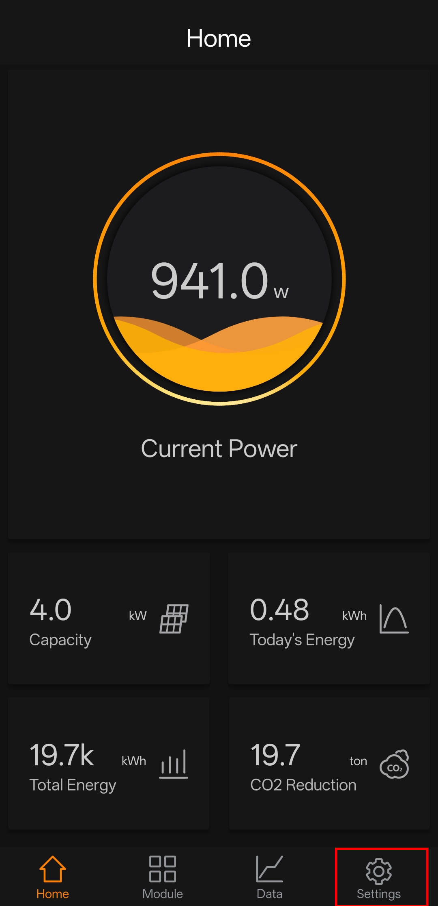
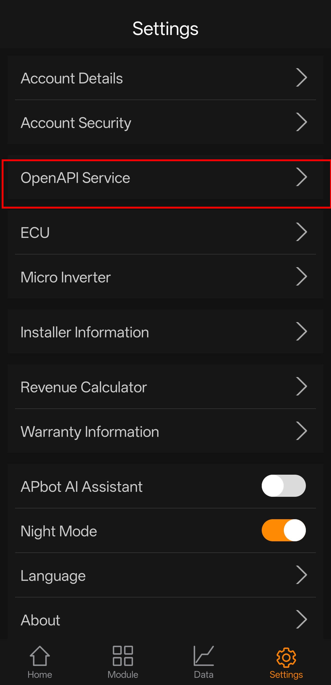
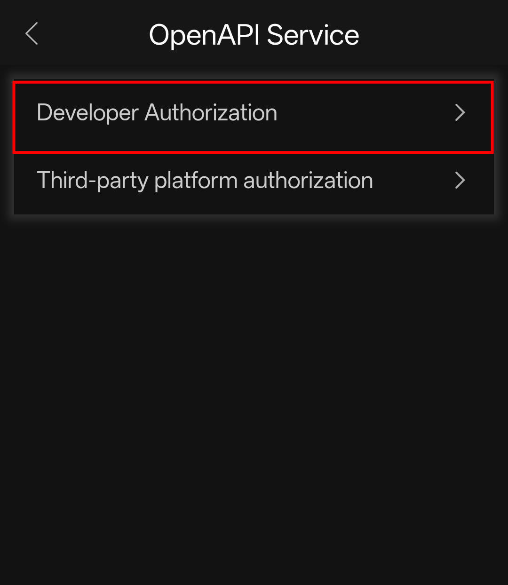
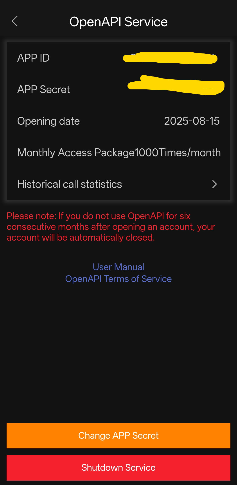
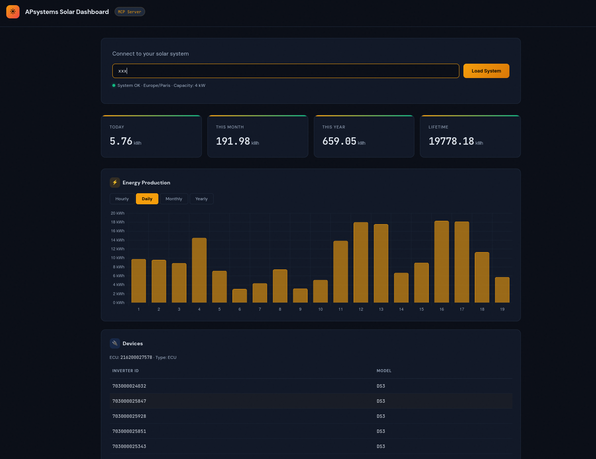
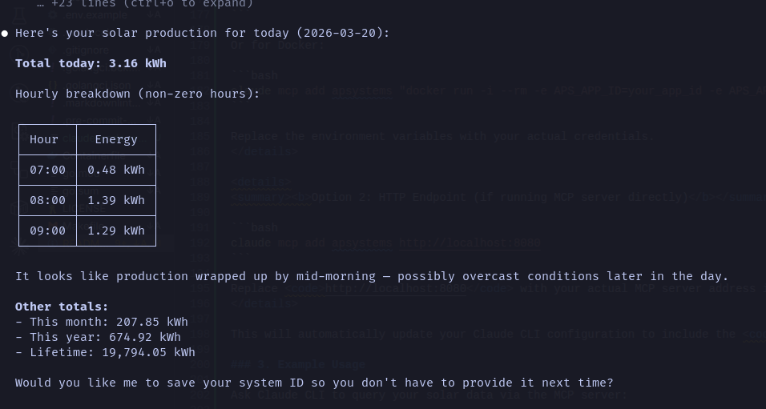
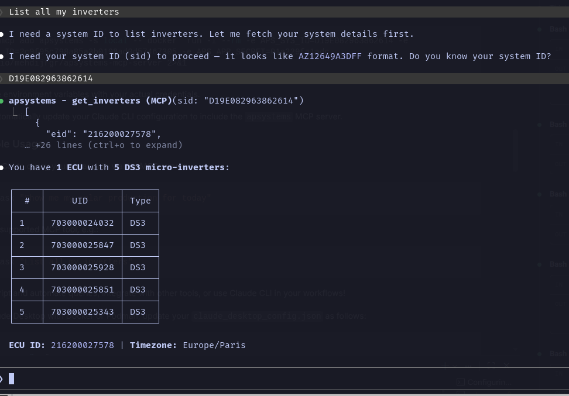

# APsystems MCP Server ☀️🛰️

A production-ready [Model Context Protocol](https://modelcontextprotocol.io/) (MCP) server written in Go
that wraps the APsystems OpenAPI, giving AI assistants like Claude direct access to your solar monitoring data.
 Includes an optional web dashboard for visual monitoring.


---

## Table of Contents

- [Features](#features)
- [Quick Start](#quick-start)
- [Prerequisites](#-prerequisites)
- [Install & Run](#install--run)
- [With Dashboard](#with-dashboard)
- [Podman](#podman)
- [Configuration](#configuration)
- [MCP Tools Reference](#mcp-tools-reference)
- [Using with Claude Desktop](#using-with-claude-desktop)
- [Using with Claude CLI](#using-with-claude-cli)
- [Project Structure](#project-structure)
- [Authentication Details](#authentication-details)
- [Development](#development)
- [API Error Codes](#api-error-codes)
- [Demo](#demo)
- [Troubleshooting](#troubleshooting)
- [Community & Support](#community--support)
- [Contributing](#contributing)

## Features

- **16 MCP tools** covering all APsystems API endpoints: system details, energy summaries, ECU/inverter/meter/storage data
- **HMAC-SHA256 signature authentication** — implements the APsystems signature protocol
- **Built-in web dashboard** — dark-themed single-page app with Chart.js energy visualizations
- **Rate limiting** — configurable request throttling to respect API limits
- **Automatic retries** — exponential back-off on transient errors and rate-limit responses
- **Structured logging** — JSON logs via `slog` with configurable levels
- **Podman support** — multi-stage Containerfile for minimal production images
- **CI/CD** — GitHub Actions for testing, linting, and cross-platform releases

## Quick Start


### 🚀 Prerequisites


Before you get started, make sure you have:

<ul>
  <li>🦫 <b>Go</b> (latest version recommended)</li>
  <li>🔑 <b>APsystems OpenAPI credentials</b> (<code>APP_ID</code> & <code>APP_SECRET</code>)</li>
  <li>🆔 <b>System ID (<code>SID</code>)</b> — <i>Find it in the APsystems EMA app under <b>Settings → Account Details</b></i></li>
</ul>

<details>
<summary><b>How to get your API credentials</b></summary>

<ol>
  <li>✉️ <b>Email APsystems support</b> and include:
    <ul>
      <li>Who you are</li>
      <li>Why you need API access</li>
      <li>What you plan to do with the data</li>
    </ul>
  </li>
  <li>📱 <b>Or grab them from the <a href="https://play.google.com/store/apps/details?id=com.apsemaappforandroid&hl=fr&pli=1">Android</a> / <a href="https://apps.apple.com/fr/app/ema-app/id984843541">iOS</a> APsystems EMA app</b>:</li>
</ol>

<p align="center">
  
  
  
  
</p>

</details>

### Install & Run

```bash
git clone https://github.com/apsystems/mcp-server.git
cd mcp-server

# Install dependencies
go mod tidy

# Set credentials
export APS_SYS_ID="your_fake_sid_1234567890"
export APS_APP_ID="your_fake_app_id_32charslong1234567890abcd"
export APS_APP_SECRET="your_fake_secret12"

# Build and run
go run ./cmd/server
```

### With Dashboard

```bash
export APS_DASHBOARD=true
export APS_DASH_ADDR=:8080
go run ./cmd/server
# Dashboard available at http://localhost:8080
```

## Dashboard Demo

### start with Podman

```bash
podman build -t apsystems-mcp -f Containerfile .
podman run --rm \
  -e APS_SYS_ID="your_fake_sid_1234567890" \
  -e APS_APP_ID="your_fake_app_id_32charslong1234567890abcd" \
  -e APS_APP_SECRET="your_fake_secret12" \
  -e APS_DASHBOARD=true \
  -p 8080:8080 \
  apsystems-mcp
```

<p align="center">
  
</p>


## Table of Environment Variables

| Variable           | Required | Example Value                              | Description                                                      |
|--------------------|----------|--------------------------------------------|------------------------------------------------------------------|
| `APS_APP_ID`       | Yes      | `your_fake_app_id_32charslong1234567890abcd` | 32-character APsystems App ID                                    |
| `APS_APP_SECRET`   | Yes      | `your_fake_secret12`                       | 12-character APsystems App Secret                                |
| `APS_SYS_ID`       | Yes      | `your_fake_sid_1234567890`                 | System ID (SID) from EMA app, Settings → Account Details         |
| `APS_BASE_URL`     | No       | `https://api.apsystemsema.com:9282`        | API base URL override                                            |
| `APS_DASHBOARD`    | No       | `true`                                     | Set `true` to enable web dashboard                               |
| `APS_DASH_ADDR`    | No       | `:8080`                                    | Dashboard listen address                                         |
| `APS_LOG_LEVEL`    | No       | `info`                                     | Log level: debug, info, warn, error                              |

## Security

> 🔒 **Security Best Practices**

- **Never commit real API credentials or secrets** to version control. Use `.env.local` or environment variables for local development.
- **Rotate your APP_SECRET and SID** if you suspect they are compromised.
- **Report vulnerabilities** by opening a security issue or emailing the maintainers.
- For production, use a secrets manager or environment injection (not plaintext files).


| Variable | Required | Default | Description |
| --- | --- | --- | --- |
| `APS_APP_ID` | Yes | — | 32-character APsystems App ID |
| `APS_APP_SECRET` | Yes | — | 12-character APsystems App Secret |
| `APS_BASE_URL` | No | `https://api.apsystemsema.com:9282` | API base URL override |
| `APS_SYS_ID` | No | — | Default system identifier (`sid`) for all API calls if not provided in tool arguments |
| `APS_DASHBOARD` | No | `false` | Set `true` to enable web dashboard |
| `APS_DASH_ADDR` | No | `:8080` | Dashboard listen address |
| `APS_LOG_LEVEL` | No | `info` | Log level: debug, info, warn, error |

## MCP Tools Reference

### System Tools

| Tool | Description |
| --- | --- |
| `get_system_details` | System info: capacity, timezone, ECUs, status |
| `get_inverters` | List all ECUs and connected micro-inverters |
| `get_meters` | List all meter IDs |
| `get_system_summary` | Energy totals: today, month, year, lifetime (kWh) |
| `get_system_energy` | Energy by period: hourly/daily/monthly/yearly |

### ECU Tools

| Tool | Description |
| --- | --- |
| `get_ecu_summary` | Energy summary for a specific ECU |
| `get_ecu_energy` | Period energy for an ECU (supports minutely telemetry) |

### Inverter Tools

| Tool | Description |
| --- | --- |
| `get_inverter_summary` | Per-channel energy for a single inverter |
| `get_inverter_energy` | Period/minutely data with DC power, current, voltage, AC telemetry |
| `get_inverter_batch_energy` | All inverters under an ECU in one call |

### Meter Tools

| Tool | Description |
| --- | --- |
| `get_meter_summary` | Consumed/exported/imported/produced totals |
| `get_meter_period` | Period energy data for a meter |

### Storage Tools

| Tool | Description |
| --- | --- |
| `get_storage_latest` | Live status: SOC, charge/discharge power |
| `get_storage_summary` | Energy summary for a storage ECU |
| `get_storage_period` | Period energy data for storage |


## Using with Claude Desktop

## Using with Claude CLI

You can also connect this MCP server to the Claude CLI for direct, scriptable access to your solar data from the terminal.

### 1. Start the MCP Server

Make sure your MCP server is running and accessible (locally or remotely):

```bash
go run ./cmd/server
# or with Podman/Docker as shown above
```


### 2. Configure Claude CLI

Add your MCP server to Claude CLI using the built-in command:

<details>
<summary><b>Podman/Docker (recommended for containerized use)</b></summary>

```bash
claude mcp add apsystems -s local -- podman run -i --rm -p 8888:8080 -e APS_DASHBOARD=true -e APS_SYS_ID=your_fake_sid_1234567890 -e APS_APP_ID=your_fake_app_id_32charslong1234567890abcd -e APS_APP_SECRET=your_fake_secret12 docker.io/mehdijrgr/apsystems-mcp-server 2>&1
```

Or for Docker:

```bash
claude mcp add apsystems -s local -- docker  run -i --rm -p 8888:8080 -e APS_DASHBOARD=true -e APS_SYS_ID=your_fake_sid_1234567890 -e APS_APP_ID=your_fake_app_id_32charslong1234567890abcd -e APS_APP_SECRET=your_fake_secret12 docker.io/mehdijrgr/apsystems-mcp-server 2>&1
```

Replace the environment variables with your actual credentials.
</details>

This will automatically update your Claude CLI configuration to include the <code>apsystems</code> MCP server.

### 3. Example Usage

Ask Claude CLI to query your solar data via the MCP server:

```bash
claude ask "Show me my solar production for today"
```



Or use any supported MCP tool, e.g.:

```bash
claude ask "List all my inverters"
```



```bash
claude ask "what's the average monthly solar production?"
```


You can script and automate queries, integrate with other tools, or use Claude CLI in your workflows!

To use Claude Desktop with Docker or Podman, update your `claude_desktop_config.json` as follows:

```json
{
  "mcpServers": {
    "apsystems": {
      "command": "podman run -i --rm -p 8888:8080 -e APS_DASHBOARD=true -e APS_SYS_ID=your_fake_sid_1234567890 -e APS_APP_ID=your_fake_app_id_32charslong1234567890abcd -e APS_APP_SECRET=your_fake_secret12 docker.io/mehdijrgr/apsystems-mcp-server 2>&1",
      "env": {}
    }
  }
}
```

Or for Docker:

```json
{
  "mcpServers": {
    "apsystems": {
      "command": "docker run -i --rm -p 8888:8080 -e APS_DASHBOARD=true -e APS_SYS_ID=your_fake_sid_1234567890 -e APS_APP_ID=your_fake_app_id_32charslong1234567890abcd -e APS_APP_SECRET=your_fake_secret12 docker.io/mehdijrgr/apsystems-mcp-server 2>&1",
      "env": {}
    }
  }
}
```

You can also mount a config file or credentials as needed:

```json
{
  "mcpServers": {
    "apsystems": {
      "command": "podman run -i --rm --env-file /path/to/env.local mehdijrgr/apsystems-mcp-server 2>&1",
      "env": {}
    }
  }
}
```

Then ask Claude things like:

- "Show me my solar production for today"
- "How much energy did my system produce this month?"
- "What's the status of my inverters?"
- "Compare my daily production this week"

## Project Structure

```shell
├── cmd/server/          # CLI entry point
├── internal/
│   ├── api/             # HTTP client with auth, retries, rate limiting
│   ├── auth/            # HMAC-SHA256 signature implementation
│   ├── dashboard/       # Optional web UI (embedded HTML)
│   ├── mcp/             # MCP tool definitions and handlers
│   └── models/          # Go structs for API responses
├── .devcontainer/       # VS Code dev container config
├── .github/workflows/   # CI/CD pipelines
├── .vscode/             # Editor settings and launch configs
├── Containerfile        # Multi-stage Podman/OCI build
├── Makefile             # Build, test, lint targets
└── go.mod
```

## Authentication Details

The APsystems API uses HMAC signature authentication. Every request includes five custom headers:

1. **X-CA-AppId** — your application identifier
2. **X-CA-Timestamp** — Unix timestamp in milliseconds
3. **X-CA-Nonce** — unique 32-character hex string (UUID without dashes)
4. **X-CA-Signature-Method** — `HmacSHA256`
5. **X-CA-Signature** — `Base64(HMAC-SHA256(stringToSign, appSecret))`

The string to sign is composed as:

```console
timestamp/nonce/appId/requestPath/HTTPMethod/HmacSHA256
```

where `requestPath` is the last segment of the URL path.

## Development

```bash
# Run tests
make test

# Lint
make lint

# Build for all platforms
make build
```

## API Error Codes

| Code | Description |
| --- | --- |
| 0 | Success |
| 1000 | Data exception |
| 1001 | No data |
| 2001 | Invalid application account |
| 2002 | Not authorized |
| 2005 | Access limit exceeded |
| 4001 | Invalid request parameter |
| 5000 | Internal server error |
| 7002 | Too many requests (auto-retried) |
| 7003 | System busy (auto-retried) |


<!-- Optionally, add a GIF or video here for more impact -->
## Troubleshooting

> ℹ️ **Note:** If you encounter API errors, check that your credentials (APP_ID, APP_SECRET, SID) are correct and that your account has API access enabled. If you see rate limit errors, try again later or adjust your request frequency.

- **Q: I get 'Not authorized' or 'Invalid application account' errors.**
  - A: Double-check your APP_ID, APP_SECRET, and SID. Make sure your account is approved for API access by APsystems.
- **Q: Claude CLI can't connect to the MCP server.**
  - A: Ensure the server is running and the address/port matches your CLI config. Check firewall or container port mappings.
- **Q: The dashboard doesn't load.**
  - A: Make sure APS_DASHBOARD is set to true and the server is running. Visit the correct port in your browser.

## Community & Support

- [GitHub Issues](https://github.com/apsystems/mcp-server/issues) — for bug reports and feature requests
- [Discussions](https://github.com/apsystems/mcp-server/discussions) — for Q&A, ideas, and community help
- Email: support@apsystems.com (for API credential requests)

## Contributing

Contributions are welcome! To get started:

1. Fork the repository
2. Create a new branch for your feature or fix
3. Make your changes and add tests if needed
4. Open a pull request with a clear description

Please see [CONTRIBUTING.md](CONTRIBUTING.md) if available, or open an issue to discuss major changes first.

## Quick Links

- [📚 Documentation](docs/architecture.md)
- [API Reference](docs/api-reference.md)
- [Open Issues](https://github.com/mjrgr/apsystems-mcp-server/issues)
- [Discussions](https://github.com/mjrgr/apsystems-mcp-server/discussions)
- [Releases](https://github.com/mjrgr/apsystems-mcp-server/releases)
- [License](LICENSE)
