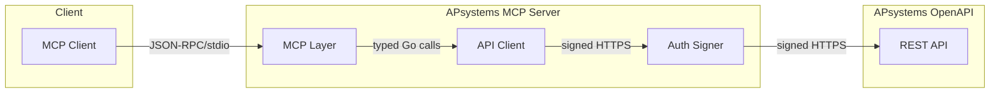

# Architecture

## Overview


The APsystems MCP Server bridges the [Model Context Protocol](https://modelcontextprotocol.io/) with the [APsystems OpenAPI](https://www.apsystemsema.com/), enabling LLMs to query solar energy system data through structured tool calls.




## Layers

### 1. MCP Layer (`internal/mcp/`)

Handles the JSON-RPC 2.0 protocol over stdio:

- **`protocol.go`** — Type definitions for JSON-RPC messages, MCP initialize/tools/ping
- **`server.go`** — Main loop: reads stdin line by line, dispatches to handlers, writes to stdout
- **`tools.go`** — Registers all 15 tools with input schemas, validation, and handler functions

The server reads newline-delimited JSON from stdin and writes newline-delimited JSON to stdout. All logs go to stderr to keep the protocol channel clean.

### 2. API Client Layer (`internal/api/`)

Typed HTTP client for the APsystems REST API:

- **`client.go`** — Generic `Do()` method with automatic signing, JSON decoding, retry logic, and rate limiting
- **`endpoints.go`** — One method per API endpoint returning typed Go structs

Features:
- Exponential backoff retries on 5xx and rate-limit errors (codes 7002, 7003)
- Minimum 200ms between requests to avoid rate limiting
- 30-second request timeout
- Automatic API error code checking (non-zero `code` field)

### 3. Auth Layer (`internal/auth/`)

Implements the APsystems signature scheme:

1. Generate a timestamp (Unix milliseconds) and a random 32-hex-char nonce
2. Build a string: `timestamp/nonce/appId/lastPathSegment/httpMethod/HmacSHA256`
3. Sign it with HMAC-SHA256 using the App Secret
4. Base64-encode the result
5. Set all five `X-CA-*` headers on the request

### 4. Models (`internal/models/`)

Go structs matching every API response shape, plus helper functions for human-readable error code and status descriptions.

### 5. Config (`internal/config/`)

Reads `APS_APP_ID`, `APS_APP_SECRET`, and optional `APS_BASE_URL` from environment variables.

## Request Flow


### Example: End-to-End Request Flow

1. **Client sends request**
	```json
	{"method": "tools/call", "params": {"name": "get_system_summary", "arguments": {"sid": "AZ12649A3DFF"}}}
	```
2. **MCP Server dispatches**
	- `server.go` receives the request, dispatches to the handler in `tools.go`.
3. **Tool handler validates and calls API**
	- `tools.go` validates arguments, calls `client.GetSystemSummary(ctx, "AZ12649A3DFF")`.
4. **API client builds and signs HTTP request**
	- `endpoints.go` calls `client.Do()`
	- `client.go` applies rate limiting, builds the HTTP request, and calls `signer.SignRequest()`
	- `signer.go` injects all required `X-CA-*` headers
5. **APsystems API responds**
	- Returns: `{ "code": 0, "data": { "today": "12.28", ... } }`
6. **Result marshaled and returned**
	- `client.go` checks for errors, unmarshals data
	- `tools.go` wraps result in a ToolCallResult
	- `server.go` sends JSON-RPC response to stdout


## Error Handling

Errors propagate back through the chain and are returned as MCP tool errors (with `isError: true`):

- **Validation errors** — Caught in tools.go before any API call
- **API errors** — Non-zero response codes mapped to human-readable descriptions
- **HTTP errors** — 4xx returned immediately, 5xx retried with backoff
- **Rate limits** — API codes 7002/7003 trigger automatic retry
- **Network errors** — Retried up to 3 times with exponential backoff

## Zero Dependencies


## Usage Example

### Get System Summary

**Request:**
```json
{
	"method": "tools/call",
	"params": {
		"name": "get_system_summary",
		"arguments": {
			"sid": "AZ12649A3DFF"
		}
	}
}
```

**Response:**
```json
{
	"content": [
		{
			"type": "json",
			"data": {
				"today": "12.28",
				"month": "320.1",
				"year": "1200.5",
				"lifetime": "4500.2"
			}
		}
	],
	"isError": false
}
```

---

## Dependencies

This project is written in Go and requires Go 1.26 or newer. It uses a minimal set of dependencies, as defined in the go.mod file:

- [https://github.com/mark3labs/mcp-go](https://github.com/mark3labs/mcp-go)
